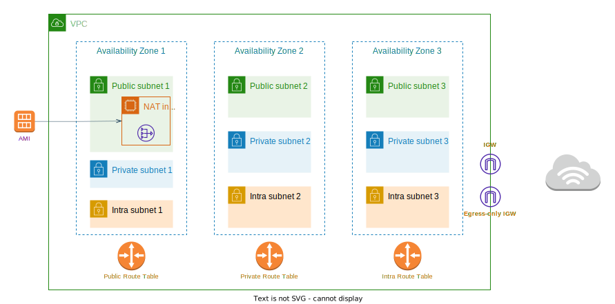

# AWS VPC




An AWS VPC architecture with public, private and intra subnets made with Terraform.

In order to reduce the costs derived from NAT Gateways, I decided to use a NAT instance instead. The NAT instance is created from an AMI configured with Alpine Linux and it only needs a 1 GB EBS volume. In order to install Alpine Linux on EC2, I followed [the guide from the Alpine Linux wiki](https://wiki.alpinelinux.org/wiki/Install_Alpine_on_Amazon_EC2).

Afterwards, I took the following steps to make the instance able to act as a NAT gateway.
```
 sudo -s # root shell session
 
 apk add iptables

 cat > /etc/sysctl.conf <<EOF
 net.ipv4.ip_forward = 1
 EOF

 sysctl -p

 iptables -t nat -A POSTROUTING -o eth0 -j MASQUERADE
 rc-update add iptables 
 /etc/init.d/iptables save

 lbu commit -d xvda # this is important. Your changes will not persist if you don't commit them to the apkvol file.
 ```

 The src/dest check is already disabled when Terraform creates the aws_instance 'nat' resource.

 Note: Although the diagram above includes three availability zones, you can configure as many as you want (as long as it falls within the AWS limits and your variables in 'terraform.tfvars' are set up accordingly).

 ## Running it

 Make sure to have the [AWS CLI](https://docs.aws.amazon.com/cli/latest/userguide/getting-started-install.html) installed on your machine. Then, run:

```
terraform init
terraform plan
terraform apply
```

Most resources here should fall into the free-tier, but they can cost you money. To destroy them, run:

```
terraform destroy
```
